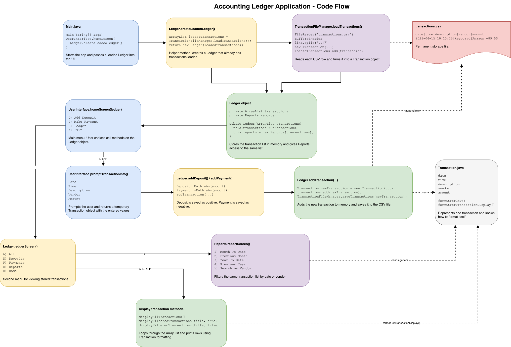

# Accounting Ledger Application

## Project Description

The **Accounting Ledger Application** is a Java command-line application created for the **Capstone 1** project in the Year Up United Application Development track.

This application allows user to track financial transactions for business or personal use. The user can add deposits, record payments, view all ledger entries and filter them from `transactions.csv` file.

---

## Project Features

The program includes three main screens that allow the user to navigate through the application and manage financial transactions.


### Home Screen

The application starts on the home screen and allows the user to choose from the following options:

| Option | Description |
|---|---|
| `D` | Add Deposit |
| `P` | Make Payment / Debit |
| `L` | Open Ledger screen |
| `X` | Exit the application |


<br>

---

### Ledger Screen

The ledger screen allows the user to view transactions in different ways:

| Option | Description |
|---|---|
| `A` | Display all transactions |
| `D` | Display deposits only |
| `P` | Display payments only |
| `R` | Open reports screen |
| `H` | Return to the home screen |

<br>


---

### Reports Screen

The reports screen allows the user to filter transactions using pre-defined reports:

| Option | Report |
|---|---|
| `1` | Month To Date |
| `2` | Previous Month |
| `3` | Year To Date |
| `4` | Previous Year |
| `5` | Search by Vendor |
| `0` | Return to Ledger screen |

<br>

---

## How Transactions Are Stored

Transactions are stored in `transactions.csv` using the following format:

```csv
date|time|description|vendor|amount
2023-04-15|10:13:25|ergonomic keyboard|Amazon|-89.50
2023-04-15|11:15:00|Invoice 1001 paid|Joe|1500.00
```

Each transaction contains:

| Field | Description |
|---|---|
| `date` | Transaction date in `yyyy-MM-dd` format |
| `time` | Transaction time in `HH:mm:ss` format |
| `description` | Description of the transaction |
| `vendor` | Vendor or customer name |
| `amount` | Positive number for deposits, negative number for payments |


<br>

## Project Structure And Code Flow

```text
src/
└── com/
    └── pluralsight/
        ├── Main.java
        ├── UserInterface.java
        ├── Ledger.java
        ├── Reports.java
        ├── Transaction.java
        └── TransactionFileManager.java

transactions.csv
```




<br>


## Class Descriptions

### `Main.java`

The `Main` class starts the application.

It creates a loaded `Ledger` object and passes it into the `UserInterface.homeScreen()` method.

```java
public class Main {
    public static void main (String[] args){
        UserInterface.homeScreen(Ledger.createLoadedLedger());
    }
}
```

<br>

---

### `UserInterface.java`

The `UserInterface` class handles the console screens, user prompts, menu choices, and display formatting.

Important responsibilities include:

- Displaying the home screen
- Asking the user for transaction information
- Printing centered page titles
- Printing transaction table headers
- Formatting net totals
- Pausing the screen with `pressEnterToContinue()`

Example method:

```java
public static Transaction promptTransactionInfo(){
    double amountEntered;

    System.out.print("Date (yyyy-MM-dd): ");
    String dateEntered = scanner.nextLine().strip();

    System.out.print("Time (HH:mm:ss): ");
    String timeEntered = scanner.nextLine().strip();

    System.out.print("Description: ");
    String descriptionEntered = scanner.nextLine().strip();

    System.out.print("Vendor: ");
    String vendorEntered = scanner.nextLine().strip();

    while (true) {
        System.out.print("Amount: ");
        try {
            amountEntered = Double.parseDouble(scanner.nextLine().strip());
            break;
        }
        catch (NumberFormatException e) {
            System.out.println("Invalid input. Please enter a number (e.g 12.34).");
        }
    }

    return new Transaction(dateEntered, timeEntered, descriptionEntered, vendorEntered, amountEntered);
}
```

This method is useful because it validates the amount input before creating a `Transaction` object. Without that validation, the program could crash if the user typed text instead of a number, because apparently users enjoy turning calculators into crime scenes.

<br>

---

### `Ledger.java`

The `Ledger` class manages the main transaction list and ledger-related actions.

Important responsibilities include:

- Adding deposits
- Adding payments
- Displaying all transactions
- Displaying deposits only
- Displaying payments only
- Opening the reports screen
- Creating a loaded ledger using a static factory method

Example static factory method:

```java
public static Ledger createLoadedLedger() {
    ArrayList<Transaction> loadedTransactions = TransactionFileManager.loadTransactions();
    return new Ledger(loadedTransactions);
}
```

This method is an important part of the project because it creates a `Ledger` object that already has transactions loaded from the CSV file. This keeps `Main.java` clean and avoids putting file-loading logic directly inside the startup code.

<br>

---

### `Reports.java`

The `Reports` class handles report filtering for the ledger.

Available reports include:

- Month To Date
- Previous Month
- Year To Date
- Previous Year
- Search by Vendor

Example report method:

```java
private void previousMonth(){
    double transactionTotal = 0;
    LocalDate previousMonth = today.minusMonths(1);

    UserInterface.printTransactionTableHeader("Previous Month Transactions", width);

    for (Transaction transaction : transactions) {
        LocalDate transactionDate = LocalDate.parse(transaction.getDate());

        if (transactionDate.getMonthValue() == previousMonth.getMonthValue() &&
            transactionDate.getYear() == previousMonth.getYear()) {
            System.out.println(transaction.formatForTransactionDisplay());
            transactionTotal += transaction.getAmount();
        }
    }

    System.out.println(UserInterface.formatTotalForDisplay(transactionTotal));
    UserInterface.pressEnterToContinue();
}
```

This method uses `LocalDate` to compare transaction dates against the previous month and prints only matching transactions.

<br>

---

### `Transaction.java`

The `Transaction` class represents one financial transaction.

Each transaction stores:

- Date
- Time
- Description
- Vendor
- Amount

It also includes formatting methods for CSV storage and console display.

```java
public String formatForCsv(){
    return String.format("%s|%s|%s|%s|%.2f", currentDate, currentTime, transactionDescription, transactionVendor, transactionAmount);
}
```

```java
public String formatForTransactionDisplay() {
    return String.format("%-10s | %-10s | %-35s | %-20s | $%.2f", currentDate, currentTime, transactionDescription, transactionVendor, transactionAmount);
}
```

These methods help keep formatting logic inside the `Transaction` class instead of repeating the same formatting code across the program.

<br>

---


### `TransactionFileManager.java`

The `TransactionFileManager` class handles reading from and writing to `transactions.csv`.

Important responsibilities include:

- Loading transactions from the CSV file
- Splitting each row by the pipe character `|`
- Creating `Transaction` objects from file data
- Saving new transactions to the file

Example save method:

```java
public static void saveTransactions(Transaction transaction){
    try{
        FileWriter fileWriter = new FileWriter("transactions.csv", true);
        BufferedWriter bufferedWriter = new BufferedWriter(fileWriter);

        bufferedWriter.newLine();
        bufferedWriter.write(transaction.formatForCsv());

        bufferedWriter.close();
    }
    catch (Exception e) {
        System.out.println("Error writing to file. Exiting program...");
    }
}
```

This separates file-handling logic from the ledger and user interface logic, which makes the project easier to read and maintain.

<br>

---


## Example Menu Flow

```text
========================================
               Home Page
========================================
What would you like to do?
D) Add Deposit 
P) Make Payment
L) Ledger
X) Exit
Enter your choice:
```

<br>


## Example Transaction Table

```text
====================================================================================================
                                      All Transactions
====================================================================================================
----------------------------------------------------------------------------------------------------
Date       | Time       | Description                         | Vendor               | Amount
----------------------------------------------------------------------------------------------------
2023-04-15 | 10:13:25   | ergonomic keyboard                  | Amazon               | $-89.50
2023-04-15 | 11:15:00   | Invoice 1001 paid                   | Joe                  | $1500.00
----------------------------------------------------------------------------------------------------
Net Total:   $1410.50
```

<br>

---


## Technologies Used
- Java
- IntelliJ IDEA
- Git
- GitHub

<br>

---

## How to Run the Project

1. Clone or download the repository.
2. Open the project in IntelliJ IDEA or another Java IDE.
3. Make sure the `transactions.csv` file exists in the project root folder.
4. Make sure the CSV file has the correct header:

```csv
date|time|description|vendor|amount
```

5. Run `Main.java`.
6. Use the menu options in the terminal to add transactions, view the ledger, and run reports.

<br>

---


## Notes
- This project is console-based only.
- ChatGPT used to help with structuring and formatting of the README.md.